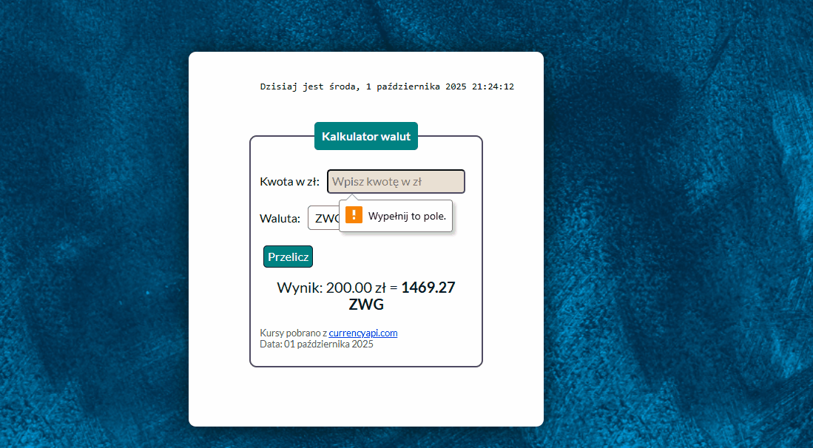

# currency-converter-react
##  

## Demo
https://annaczerwonka.github.io/currency-converter-react/

## Description
The topic of this page is a currency converter. At the center of the page, there is a form window containing two elements:

- a currency selection field from a dropdown list

- a field to enter the amount in the selected currency

After filling out the form, click the “Convert” button to get the equivalent amount in the selected currency relative to PLN.
The exchange rates are fetched from an external API and are current as of the date they were retrieved.
If there is a problem fetching the data, the user sees a message suggesting to check their internet connection.
Additionally, at the top of the page, a live clock displays the current date and time, updating every second. 

## Technologies
- HTML
- CSS (Flexbox, Grid)
- JavaScript (ES6+)
- JSX (JavaScript XML)
- React.js
- React Hooks (`useState`, `useEffect`, `useCurrentDate`, `useRatesData`)
- JavaScript Date API (`toLocaleString`)
- Styled-components
- Create React App (Webpack, Babel, ESLint, PostCSS, CSS Loader and Style   
  Loader)
- External API for currency rates

# Getting Started with Create React App

This project was bootstrapped with [Create React App](https://github.com/facebook/create-react-app).

## Available Scripts

In the project directory, you can run:

### `npm start`

Runs the app in the development mode.\
Open [http://localhost:3000](http://localhost:3000) to view it in your browser.

The page will reload when you make changes.\
You may also see any lint errors in the console.

### `npm run build`

Builds the app for production to the `build` folder.\
It correctly bundles React in production mode and optimizes the build for the best performance.

The build is minified and the filenames include the hashes.\
Your app is ready to be deployed!

See the section about [deployment](https://facebook.github.io/create-react-app/docs/deployment) for more information.

### `npm run eject`

**Note: this is a one-way operation. Once you `eject`, you can't go back!**

If you aren't satisfied with the build tool and configuration choices, you can `eject` at any time. This command will remove the single build dependency from your project.

Instead, it will copy all the configuration files and the transitive dependencies (webpack, Babel, ESLint, etc) right into your project so you have full control over them. All of the commands except `eject` will still work, but they will point to the copied scripts so you can tweak them. At this point you're on your own.

You don't have to ever use `eject`. The curated feature set is suitable for small and middle deployments, and you shouldn't feel obligated to use this feature. However we understand that this tool wouldn't be useful if you couldn't customize it when you are ready for it.

